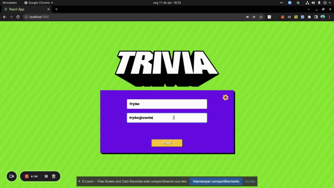

  

Este projeto em grupo foi desenvolvido por **Viviane Puga**, **Gabriel Ferrari**, **Karen Cano**, **Rosy Mariana**, **Pedro Tavares**, e **Raynan**,  como parte do programa de estudos da **Trybe**

## Habilidades - _by Trybe_
Nesse projeto, vocês serão capazes de:
  - Criar um store Redux em aplicações React
  - Criar reducers no Redux em aplicações React
  - Criar actions no Redux em aplicações React
  - Criar dispatchers no Redux em aplicações React
  - Conectar Redux aos componentes React
  - Criar actions assíncronas na sua aplicação React que faz uso de Redux.

## O que deverá ser desenvolvido - _by Trybe_
Vocês deverão desenvolver um jogo de perguntas e respostas baseado no jogo **Trivia** _(tipo um show do milhão americano rs)_ utilizando _React e Redux_, desenvolvendo em grupo suas funcionalidades de acordo com as demandas definidas em um quadro _Kanban_. A partir dessas demandas, teremos uma aplicação onde a pessoa usuária poderá:
  - Logar no jogo e, se o email tiver cadastro no site [Gravatar](https://pt.gravatar.com/), ter sua foto associada ao perfil da pessoa usuária.
  - Acessar a página referente ao jogo, onde se deverá escolher uma das respostas disponíveis para cada uma das perguntas apresentadas. A resposta deve ser marcada antes do contador de tempo chegar a zero, caso contrário a resposta deverá ser considerada errada.
  - Ser redirecionada, após 5 perguntas respondidas, para a tela de score, onde o texto mostrado depende do número de acertos.
  - Visualizar a página de ranking, se quiser, ao final de cada jogo.
  - Configurar algumas opções para o jogo em uma tela de configuração acessível a partir do cabeçalho do app.

